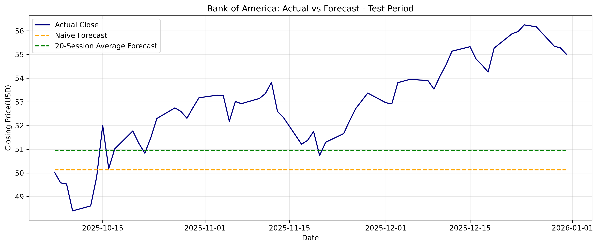

# 🏦 Bank of America Financial Analysis

### Historical Stock Prices · Trading Volume · Exploratory Data Analysis

An internship project exploring Bank of America’s historical stock
prices and trading activity through data cleaning, statistical
summaries and visual analysis.

👤 **Author:** Preyash Gandhi  
💼 **Internship Role:** Junior Data Analyst – Banking & Financial Services  
📌 **Current Stage:** Week 1 — Data Acquisition, Cleaning and EDA

---

## 🎯 Project Objective

Prepare a public financial dataset, assess its quality and explore
historical patterns in stock prices and trading volume. The Week 1
analysis provides a documented foundation for subsequent forecasting
and risk analysis.

## 📊 Dataset Overview

| Attribute | Details |
|:---|:---|
| Company | Bank of America Corporation |
| Stock ticker | BAC |
| Source | Kaggle |
| Period | 21 February 1973 – 31 December 2025 |
| Records | 13,329 |
| Original columns | 8 |
| Prepared dataset columns | 11 |
| Frequency | Daily trading records |

🔗 **[View the dataset on Kaggle](https://www.kaggle.com/datasets/isaaclopgu/bank-of-america-corp-stock-data-daily-updated)**

### Original Fields

| Column | Description |
|:---|:---|
| `Date` | Date of the trading record |
| `Open` | Opening stock price |
| `High` | Highest stock price during the day |
| `Low` | Lowest stock price during the day |
| `Close` | Closing stock price |
| `Volume` | Number of shares traded |
| `ticker` | Stock symbol |
| `name` | Company and dataset description |

---

## 🧹 Data Cleaning and Preparation

| Check or Step | Result |
|:---|:---|
| Missing values | None found |
| Duplicate rows | None found |
| Duplicate dates | None found |
| Date processing | Converted to datetime with America/New_York timezone |
| Record order | Sorted chronologically |
| Zero-volume records | 6 flagged and retained |
| Closing-price outliers | 66 flagged and retained |
| Final row count | All 13,329 records retained |

Three columns were added:

- 📅 `Year` — supports annual summaries.
- 🚩 `Zero_Volume_Flag` — identifies records with zero trading volume.
- 🔎 `Close_Outlier_Flag` — identifies closing prices outside the
  full-history 1.5 × IQR boundaries.

The causes of zero-volume records were not confirmed. Price outliers
were retained because statistical unusualness alone does not establish
a data error.

---

## 📈 Summary Statistics

| Statistic | Closing Price | Volume (Shares) |
|:---|---:|---:|
| Count | 13,329 | 13,329 |
| Mean | 12.86 | 38,717,124.16 |
| Standard deviation | 12.28 | 76,606,483.08 |
| Minimum | 0.27 | 0 |
| 25th percentile | 1.77 | 489,600 |
| Median | 10.10 | 7,504,200 |
| 75th percentile | 21.21 | 46,978,800 |
| Maximum | 56.25 | 1,226,791,300 |

*Values are rounded where applicable. These statistics summarize the
full historical period; the standard deviation of price levels is
not daily return volatility.*

---

## 🖼️ Visual Analysis

### 1️⃣ Historical Closing Price Trend

- The chart tracks closing prices across the dataset’s historical period.
- The lowest recorded closing price was approximately **0.27** on
  **20 December 1974**.
- The highest was **56.25** on **24 December 2025**.

### 2️⃣ Annual Average Closing Price

- Annual average closing price rose from **12.49 in 2016** to
  **25.20 in 2019**, before declining in 2020.
- Following an increase in 2021, annual averages declined in 2022 and 2023.
- **2025 recorded the highest annual average of 46.61** within the
  displayed ten-year period.

*Each bar represents an annual average price, not an annual return.*

### 3️⃣ Daily Trading Volume

- Prominent trading-volume spikes appear around **2008–2010**.
- All five highest-volume trading days occurred in **2009**.
- The maximum daily volume was approximately **1,226.79 million shares**
  on **4 December 2009**.

| Date | Volume (Shares) |
|:---|---:|
| 4 December 2009 | 1,226,791,300 |
| 20 May 2009 | 1,197,984,500 |
| 9 April 2009 | 1,029,694,600 |
| 7 May 2009 | 946,806,700 |
| 6 May 2009 | 924,590,100 |

*Volume measures trading activity. It does not by itself reveal the
direction of price movement or establish the causes of a spike.*

### 4️⃣ Closing Price Distribution

- The histogram groups closing prices into **30 intervals**.
- More observations occur in lower price ranges, with a long tail
  toward higher prices.
- The distribution is **right-skewed**, consistent with the
  **mean of 12.86** exceeding the **median of 10.10**.

*This chart combines observations from 1973–2025 and does not represent
future price probabilities.*

### 5️⃣ Closing Price Outliers

- The middle 50% of closing prices lie approximately between
  **1.77 and 21.21**.
- The IQR boundaries were approximately **−27.40 and 50.38**.
- **66 records** exceeded the upper boundary, all from **2025**.
- These observations were flagged and retained.

*The negative lower boundary is a statistical threshold, not an
observed negative stock price.*

---

## 💡 Key Findings

✅ No missing values, duplicate rows or duplicate dates were detected.  
✅ Six zero-volume observations were flagged for transparency.  
✅ The full-history closing-price distribution was right-skewed.  
✅ All five highest-volume trading days occurred in 2009.  
✅ All 66 IQR closing-price outliers occurred in 2025.  
✅ All original records were preserved for subsequent analysis.

---

## 📂 Project Files

| File | Purpose |
|:---|:---|
| [📓 Week1_EDA.ipynb](Week1_EDA.ipynb) | Python notebook with analysis and outputs |
| [📄 Week1_EDA_Report.docx](Week1_EDA_Report.docx) | Detailed Week 1 report |
| [📥 Original dataset](Bank_of_America_historical_data.csv) | Downloaded historical records |
| [🧹 Prepared dataset](Bank_of_America_Cleaned.csv) | Data with year and flag columns |
| [📈 Price trend](01_Closing_Price_Trend.png) | Historical closing-price chart |
| [📊 Annual averages](02_Annual_Average_Close.png) | Annual average closing-price chart |
| [📉 Trading volume](03_Daily_Trading_Volume.png) | Daily trading-volume chart |
| [📊 Price distribution](04_Closing_Price_Distribution.png) | Closing-price histogram |
| [🔎 Outlier analysis](05_Closing_Price_Box_Plot.png) | Closing-price box plot |

---

## ⚙️ Run the Notebook

1. Clone or download this repository.
2. Install the required packages:

       pip install pandas matplotlib jupyter

3. Open `Week1_EDA.ipynb` in Jupyter or VS Code.
4. Keep `Bank_of_America_historical_data.csv` in the notebook’s
   working folder.
5. Select the Python kernel and run the cells from top to bottom.

The notebook exports the prepared CSV and five chart images.
Running it again overwrites exports with the same filenames.

---

## 📝 Limitations

- The analysis covers one company and cannot represent the entire
  banking sector.
- The downloaded file ends on **31 December 2025** and contains no
  2026 trading records.
- Price adjustments for stock splits and dividends remain unconfirmed,
  limiting investment-return interpretation.
- The causes of zero-volume records and volume spikes were not verified.
- Full-history summaries combine different market periods.
- Historical observations do not establish causes or predict future
  performance.

---

## 🚀 Next Stage

- Define a forecasting target and time horizon.
- Split observations chronologically into training and test sets.
- Compare forecasts against a simple baseline.
- Verify price-adjustment details before interpreting investment returns.

---

## 👤 Author

**Preyash Gandhi**

🔗 [GitHub Profile](https://github.com/preyashgandhi00-stack)

---

## 🔮 Week 2 — Financial Forecasting

### 📌 Project Overview

In Week 2, I built a basic forecasting workflow using historical Bank of America (BAC) daily stock data. The goal was to forecast the **Closing Price (USD)** and compare two simple forecasting methods on a chronological test period.

This project demonstrates how to prepare time series data, preserve the order of observations, create a holdout test set, evaluate forecast errors, and explain the results and limitations.

> **Data note:** The historical dataset ends on **December 31, 2025**. The forecasts in this project use that historical data and should not be interpreted as live market forecasts or investment advice.

### 🎯 Objective

- Forecast Bank of America’s daily closing price.
- Compare a **Naive Forecast** with a **20-Session Average Forecast**.
- Evaluate both methods using **Mean Absolute Error (MAE)** and **Root Mean Squared Error (RMSE)**.
- Generate a simple forecast for the next 60 trading sessions after the available historical data.

### 🗂️ Dataset and Preparation

The analysis uses the cleaned Bank of America stock dataset from Week 1. The `Date` column was converted to a datetime format, and the rows were sorted chronologically before selecting `Date` and `Close` for forecasting.

| Item | Details |
|---|---|
| Forecast target | Closing Price (USD) |
| Historical records | 13,329 |
| Historical period | February 21, 1973 – December 31, 2025 |
| Training records | 13,269 |
| Test records | 60 |
| Training period ends | October 6, 2025 |
| Test period | October 7 – December 31, 2025 |

The last 60 observations were kept as the test set. The training data came before the test data, so the time order was preserved.

### 🧪 Forecasting Methods

**1. Naive Forecast**

The Naive model uses the last closing price in the training data as the forecast for every date in the test period.

- Forecast value: **$50.13**
- This is a simple baseline for comparison.

**2. 20-Session Average Forecast**

This model uses the average closing price from the last 20 training observations as a constant forecast for every date in the test period.

- Forecast value: **$50.95**
- The 20 observations represent roughly one trading month.
- The test period was not used to calculate this forecast value.

Both methods produce a flat forecast line. They do not update using actual prices from the test period.

### 📊 Model Performance

| Model | MAE (USD) | RMSE (USD) |
|---|---:|---:|
| Naive Forecast | 2.86 | 3.28 |
| 20-Session Average | **2.23** | **2.64** |

For this 60-observation test period, the 20-Session Average had lower MAE and RMSE than the Naive Forecast. This means its errors were smaller on average during this test window. It does not guarantee that it will perform better in other periods.

- **MAE** shows the average absolute difference between actual and forecast prices.
- **RMSE** also measures forecast error, while giving larger errors more weight.

### 📈 Actual vs Forecast

The chart compares actual closing prices with the two constant forecasts during the test period.

The actual closing price moved during the test period, while both forecasts stayed flat. The chart makes it easier to see where the forecasts were above or below the actual prices.

### 🔭 Forecast Beyond the Historical Data

Using the last 20 available closing prices in the dataset, the average forecast was approximately **$54.85**. This value was repeated for the next 60 trading-session steps.

- Forecast origin: **December 31, 2025**
- Forecast horizon: **60 trading sessions**
- Forecast value: **approximately $54.85 per session**

This is a basic constant forecast. The future forecast has not been evaluated against actual prices after the historical data ends.

### 📁 Week 2 Files

- [`Week2_Forecasting.ipynb`](Week2_Forecasting.ipynb) — notebook with data preparation, forecasts, evaluation, and analysis.
- [`Week2_Forecasting_Report.docx`](Week2_Forecasting_Report.docx) — written forecasting report.
- [`Week2_Test_Results.csv`](Week2_Test_Results.csv) — actual test-period prices and forecast results.
- [`Week2_Model_Comparison.csv`](Week2_Model_Comparison.csv) — MAE and RMSE comparison.
- [`Week2_Future_Forecast.csv`](Week2_Future_Forecast.csv) — 60-session forecast output.
- [`Week2_01_Actual_vs_Forecast.png`](Week2_01_Actual_vs_Forecast.png) — actual-versus-forecast chart.

### ⚠️ Limitations

- Only 60 observations were used to evaluate the models.
- Both forecasting methods produce constant forecasts and cannot capture price trends or daily fluctuations.
- The analysis uses the closing price only and does not include company fundamentals, market news, or other external factors.
- The 60-session forecast is a simple baseline, not a prediction of guaranteed future performance.
- The dataset ends on December 31, 2025, so this analysis does not represent current market data.

### ✅ Key Takeaway

The 20-Session Average produced lower errors than the Naive Forecast during the selected test period. This project provided practice in time series preparation, chronological validation, forecast evaluation, and communicating the limits of a basic model.

-----

**Tools used:** Python · Pandas · Matplotlib · Jupyter Notebook
